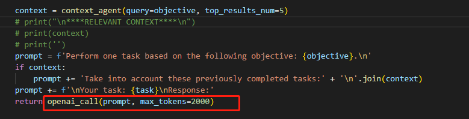

# babyagi使用

Assignee: Lealand
Status: Not Started
Due: July 16, 2023
Project: 汪俊辰 (https://www.notion.so/867a93a5306e4fa5ac709d546f3c1faf?pvs=21)
Priority: Low

官网：[GitHub - yoheinakajima/babyagi](https://github.com/yoheinakajima/babyagi)

参考Readme，使用docker安装。

## Pre：

将requirements.txt的内容替换为：

```python
pydantic==1.10.11
argparse==1.4.0
openai==0.27.4
chromadb==0.3.21
pre-commit>=3.2.0
python-dotenv==1.0.0
tiktoken==0.3.3
llama-cpp-python>=0.1.42
```

## 安装过程Bug：PydanticImportError: ’BaseSettings’ has been moved to the `pydantic-settings` package.

```powershell
babyagi  | Traceback (most recent call last):
babyagi  |   File "/app/./babyagi.py", line 14, in <module>
babyagi  |     import chromadb
babyagi  |   File "/usr/local/lib/python3.11/site-packages/chromadb/__init__.py", line 1, in <module>
babyagi  |     import chromadb.config
babyagi  |   File "/usr/local/lib/python3.11/site-packages/chromadb/config.py", line 1, in <module>
babyagi  |     from pydantic import BaseSettings
babyagi  |   File "/usr/local/lib/python3.11/site-packages/pydantic/__init__.py", line 207, in __getattr__
babyagi  |     return _getattr_migration(attr_name)
babyagi  |            ^^^^^^^^^^^^^^^^^^^^^^^^^^^^^
babyagi  |   File "/usr/local/lib/python3.11/site-packages/pydantic/_migration.py", line 288, in wrapper
babyagi  |     raise PydanticImportError(
babyagi  | pydantic.errors.PydanticImportError: `BaseSettings` has been moved to the `pydantic-settings` package. See https://docs.pydantic.dev/2.0.3/migration/#basesettings-has-moved-to-pydantic-settings for more details.
babyagi  |
babyagi  | For further information visit https://errors.pydantic.dev/2.0.3/u/import-error
babyagi exited with code 0
```

解决：删除docker中和babyagi相关的所有containers和images，然后将requirements.txt中的内容替换为：

```python
pydantic==1.10.11
argparse==1.4.0
openai==0.27.4
chromadb==0.3.21
pre-commit>=3.2.0
python-dotenv==1.0.0
tiktoken==0.3.3
llama-cpp-python>=0.1.42
```

然后重新构建。

## 测试使用：

[babyagi测试结果1](babyagi使用/babyagi测试结果1.md)

babyagi是个轻量级的AI助理，其关键设计目标是保持简单。

持续执行，不会自己停止。需要及时在docker停止container。

包含另外一个模块，babycoder，可以写代码。

更改目标需要关闭docker中的container，在终端重新启动。

## 源码阅读

核心就是 babyagi.py。

在调用openai接口时，参数maxtoken会影响最终生成的结果的文本长度。



结构非常简单，每次开始执行时从tasks_storage中取出一项任务执行，执行完成后将结果加入results_storage，之后根据已完成的任务和目标生成新的任务名单。

我在生成新的任务这一环节前加入了“检查目标是否已经完成”这一环节，这样可以在一定程度上解决babyagi无尽执行的问题。

babyagi目前本质上应该只是一个基于ChatGPT的文字处理脚本，并不具有使用工具的高级功能，更遑论具身智能。